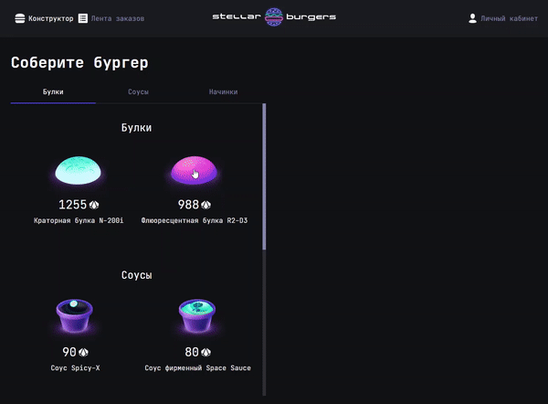

Ссылка на выложенный проект - http://ashabanyan.students.nomoredomains.work/

# Burger Constructor

Приложение представляет из себя конструктор бургеров! Пользователь самостоятельно может собрать себе бургер, оформить заказ и отследить его готовность!

## Demo

Insert gif or link to demo

## Other Common Github Profile Sections

👩‍💻 I'm currently working on...

🧠 I'm currently learning...

👯‍♀️ I'm looking to collaborate on...

🤔 I'm looking for help with...

💬 Ask me about...

📫 How to reach me...

😄 Pronouns...

⚡️ Fun fact...
