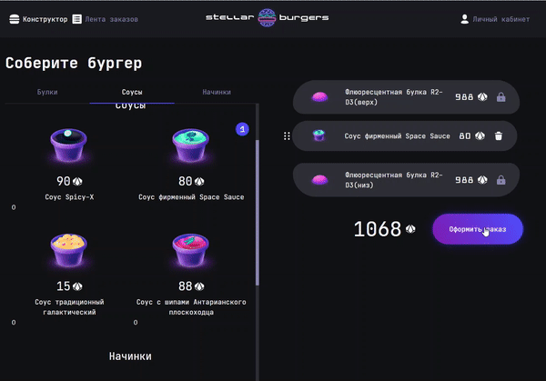

# Burger Constructor

Приложение представляет из себя конструктор бургеров! Пользователь самостоятельно может собрать себе бургер...


...оформить заказ...



...и отслеживать его в режиме реального времени! (внимание на блок "В Работе" и список заказов)


## 🛠 Skills

Javascript, HTML, CSS...

- ReactJS
- Redux
- Typescript
- React DND
- Jest
- Cypress

## Run Locally

Clone the project

```bash
  git clone https://github.com/ashabanyan/react-burger.git
```

Go to the project directory

```bash
  cd react-burger
```

Install dependencies

```bash
  npm install
```

Start the server

```bash
  npm run start
```

Build and deploy

```bash
  npm deploy-script
```

## Deployed project

[Stellar Burger](http://ashabanyan.students.nomoredomains.work/)
